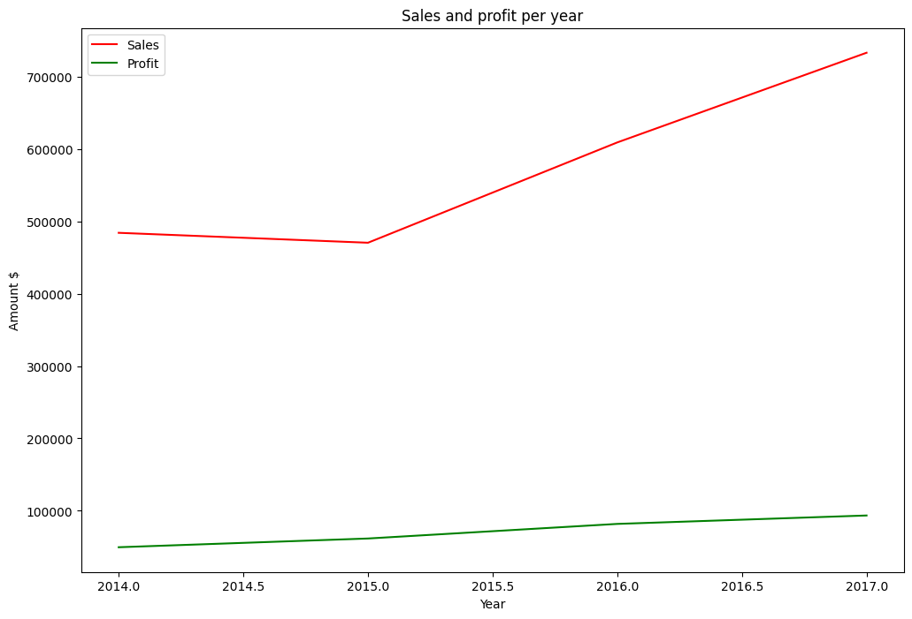
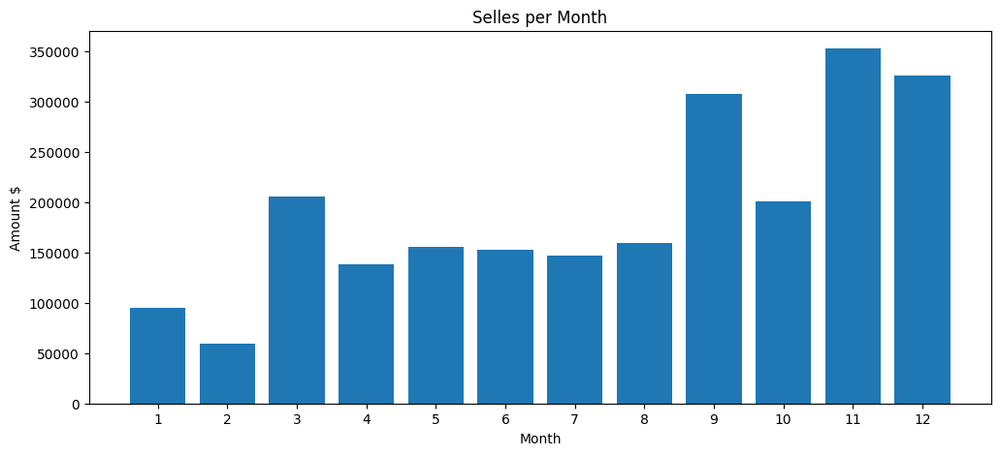
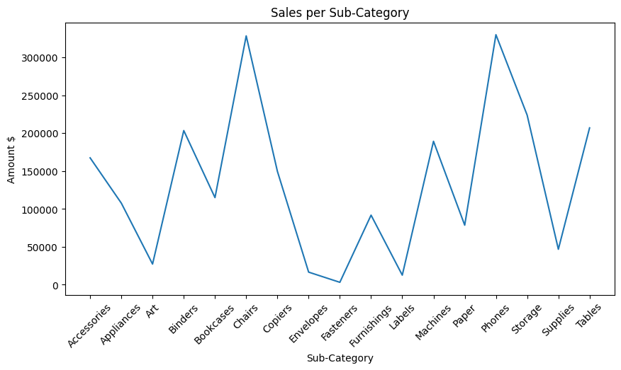
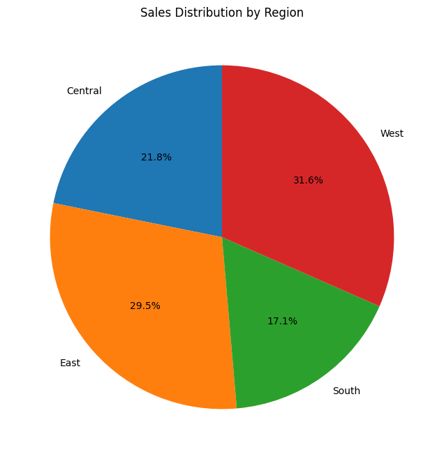
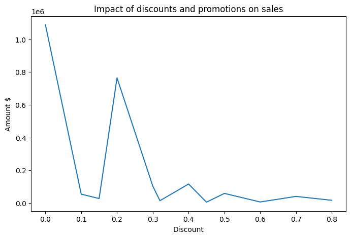
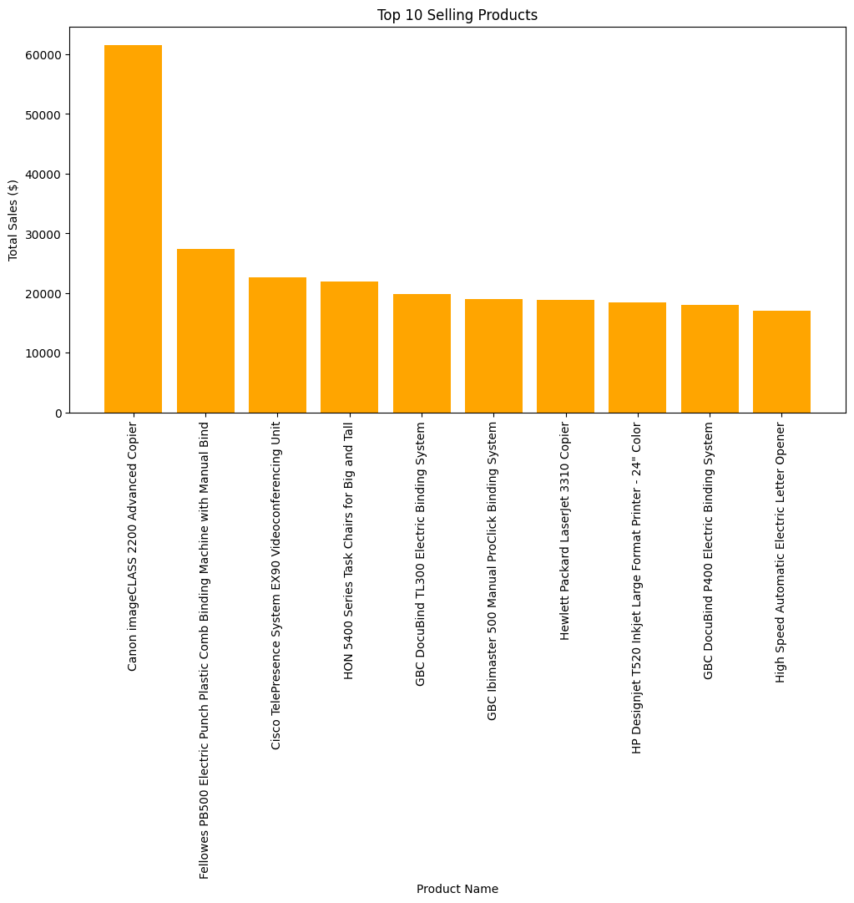
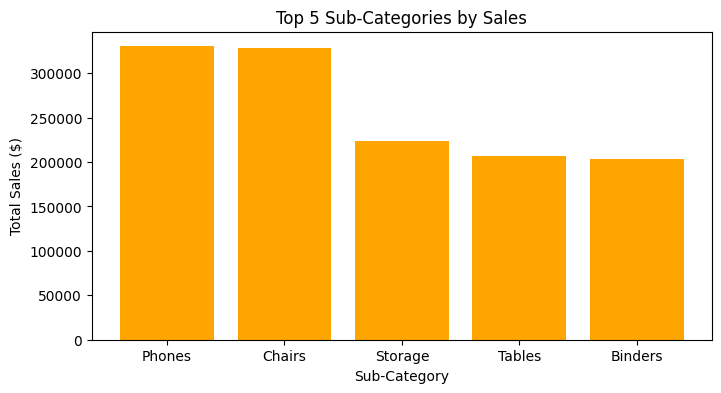

# EDA Superstore Project 

[](https://www.python.org/)
[](https://numpy.org/)
[](https://pandas.pydata.org/)
[](https://matplotlib.org/)

---

## Project Overview
This project performs **Exploratory Data Analysis (EDA)** on a Superstore dataset to uncover insights about sales, profits, products, and customers.  
The goal is to **analyze trends, detect patterns, and provide actionable recommendations** to improve business strategy.

---

## Dataset 
- **Source:** [Kaggle Superstore Dataset](https://www.kaggle.com/datasets/vivek468/superstore-dataset-final)  
- **File format:** CSV  
- **Columns include:**
  - `Order ID`, `Order Date`, `Ship Date`, `Ship Mode`, `Customer ID`
  - `Customer Name`, `Segment`, `Country`, `City`, `State`, `Postal Code`
  - `Region`, `Product ID`, `Category`, `Sub-Category`, `Product Name`
  - `Sales`, `Quantity`, `Discount`, `Profit`

---

## Project Goals 
- Understand overall **sales and profit trends**
- Identify **top-selling products and categories**
- Explore **customer segments and purchasing patterns**
- Detect **anomalies** or areas of improvement
- Visualize data with **graphs and charts**

---

## Tools & Libraries 
- **Python 3.17
- **Data Manipulation:** `pandas`, `numpy`
- **Visualization:** `matplotlib`

---

## EDA Steps 
1. **Data Loading & Inspection**
   - Load dataset and inspect columns, data types, and missing values
2. **Data Cleaning**
   - Handle missing values, duplicates, and data type corrections
3. **Descriptive Statistics**
   - Compute mean, median, min, max for numeric columns
4. **Data Visualization**
   - Sales & profit trends over time
   - Top-selling products and categories
   - Regional sales & profits
   - Customer segments
5. **Correlation Analysis**
   - Explore relationships between `Sales`, `Profit`, and `Quantity`
6. **Insights & Recommendations**
   - Highlight key findings for business improvements

---

## Key Insights 
- **Furniture category:** High revenue but low profit margins  
- **Technology products:** Moderate sales, high profit  
- **West region:** Best revenue performance  
- **Customer segments:** Corporate clients generate the most profit per order  

---

## Visualizations 
### **Sales and Profit per Year**  

### **Sales per Month**  

### **Sales by Sub-Category**

### **Sales Distribution by Region**  

### **Impact of Discounts and Promotions on Sales**  

### **Top 10 Products by Sales**  

### **Top 5 Sub-Categories by Sales**  



---

## How to Run 
1. Clone the repository:
```bash
git clone https://github.com/Fares-Ayman-1/EDA_Super_Store.git
```


